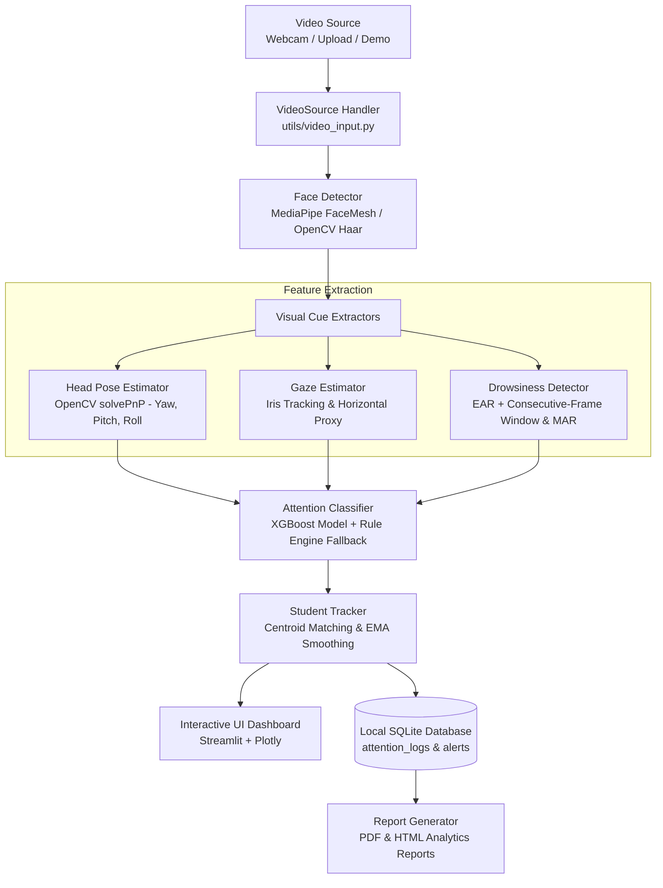

# 🎓 AI-Based Classroom Attention Monitoring System

> **Lightweight Visual Engagement Analytics & Decision-Support Aid for Educators**  
> *An on-device, privacy-preserving computer vision system providing approximate visual proxies for classroom attention.*

---

## 1. Project Overview

In traditional and hybrid classroom environments, teachers often face difficulties observing visual cues across many students simultaneously. The **AI-Based Classroom Attention Monitoring System** is an assistive software tool designed to process video streams (webcam, uploaded video file, or synthetic classroom demonstration), detect multiple faces, track anonymous temporary IDs, calculate measurable facial geometry metrics, and provide real-time approximate engagement analytics on an interactive teacher dashboard.

This project is built for **local, on-device execution** without sending video feeds or biometric identifiers to external cloud APIs or persistent remote databases.

---

## 2. Problem Statement

Educators need timely, class-wide awareness of engagement dips, prolonged fatigue, or visual distraction during instructional delivery. However, existing commercial systems often:
- Require specialized proprietary hardware.
- Rely on intrusive facial recognition that identifies and profiles individual students.
- Transmit sensitive student biometric video data to third-party cloud infrastructure.
- Make unsubstantiated claims regarding measuring "internal cognitive focus."

There is a need for a **lightweight, ethical, and hardware-accessible prototype** that focuses strictly on non-invasive visual proxies (head orientation, gaze direction, eye closure) to offer high-level pedagogical feedback while safeguarding student privacy.

---

## 3. Objectives

1. **Multi-Student Visual Tracking**: Track multiple students simultaneously in real time with persistent anonymous session identifiers (`Student #1`, `Student #2`, etc.) without face recognition.
2. **Visual Cue Extraction**: Quantify 3D head pose (Yaw, Pitch, Roll), approximate gaze orientation, and eye-closure ratio (EAR).
3. **Approximation of Attention State**: Classify students into heuristic categories: *Attentive*, *Distracted*, *Drowsy*, or *Unknown / Insufficient Data*.
4. **Pedagogical Dashboard**: Deliver real-time aggregate indicators (average class attention, category distribution, FPS, timeline trend).
5. **Sustained Fatigue Alerts**: Flag prolonged disengagement (> 4 seconds) while distinguishing routine blinks from drowsiness.
6. **Data Minimization & Reporting**: Store only minimal numeric logs in a local SQLite database and export summary session reports (PDF and HTML).

---

## 4. Features

- **Multi-Source Input**: Supports live webcams, uploaded classroom video files (MP4, AVI, MOV), and a built-in synthetic demo video.
- **Anonymous Tracking**: Centroid-based tracking maintains temporal continuity and Exponential Moving Average (EMA) smoothing without facial biometric storage.
- **3D Head Pose (solvePnP)**: Real-time estimation of Yaw, Pitch, and Roll with directional feedback (*Facing Screen*, *Looking Left*, *Looking Right*, *Looking Down*).
- **Iris-Refined Gaze Estimation**: Iris relative displacement within eye boundaries providing horizontal gaze proxy.
- **Fatigue & Drowsiness Engine**: Eye Aspect Ratio (EAR) with consecutive-frame filtering to eliminate single-blink false positives; Mouth Aspect Ratio (MAR) for yawn indicators.
- **Hybrid Attention Classification**: Pre-trained XGBoost classifier paired with a rule-based fallback engine.
- **Dark Glassmorphism Dashboard**: Streamlit-powered teacher console featuring live video canvas with directional vectors and real-time Plotly trend charts.
- **Privacy Controls**: Single-click real-time face blurring and anonymous student ID masking.
- **Exportable Reports**: One-click generation of PDF and HTML session summary reports.

---

## 5. System Architecture



---

## 6. Technologies Used

- **Language**: Python 3.10 – 3.12 (Python 3.11 recommended)
- **Computer Vision**: OpenCV (`opencv-python`), MediaPipe FaceMesh
- **Machine Learning**: XGBoost, Scikit-Learn, NumPy, SciPy
- **Data Analytics & Storage**: Pandas, SQLite3
- **Frontend Dashboard**: Streamlit, Plotly Express & Graph Objects
- **Document Generation**: ReportLab, HTML5 / CSS3
- **Testing**: PyTest

---

## 7. Installation

### 1. Clone or Open the Repository
```bash
cd Student_Attention_Tracker_System
```

### 2. Verify Python Installation
```bash
python --version
# Recommended: Python 3.11.x
```

### 3. Install Dependencies
```bash
pip install -r requirements.txt
```

---

## 8. How to Run

Launch the interactive teacher dashboard:
```bash
streamlit run app.py
```
Open your web browser at `http://localhost:8501`.

---

## 9. How to Use Webcam

1. In the left sidebar, locate **📹 Video Source**.
2. Select **📷 Live Webcam Feed**.
3. Set the **Webcam Index** (default is `0` for primary built-in webcam).
4. Click **▶️ Start Session**.
5. The dashboard will acquire camera access, stream frames locally, and display visual bounding boxes with directional arrows.

---

## 10. How to Use Uploaded Video

1. In the sidebar, select **📹 Upload Video File**.
2. Click **Browse files** and upload an MP4, AVI, or MOV classroom recording.
3. Click **▶️ Start Session**.
4. The system processes the uploaded video sequentially and automatically stops at video end (EOF).
5. All uploaded temporary files are automatically cleaned up from disk upon stream completion.

---

## 11. Attention-Scoring Methodology

The system evaluates attention as an **approximate visual score** on a 0–100 scale:

$$\text{Raw Score} = (S_{\text{pose}} \times 0.35) + (S_{\text{gaze}} \times 0.35) + (S_{\text{drowsiness}} \times 0.30) - \text{Penalties}$$

### Visual Feature Components
- **Pose Frontality Score ($S_{\text{pose}}$)**: Measures deviation from the screen normal using solvePnP Euler angles ($\text{Yaw}, \text{Pitch}, \text{Roll}$).
- **Gaze Score ($S_{\text{gaze}}$)**: Evaluates iris horizontal displacement relative to eye corners.
- **Drowsiness Score ($S_{\text{drowsiness}}$)**: Derived from Eye Aspect Ratio (EAR). Open eyes correspond to $\text{EAR} \approx 0.30+$, while closed eyes exhibit $\text{EAR} < 0.21$.

### State Categorization
- 🟢 **Attentive**: Score $\ge 65\%$ with head yaw within threshold.
- 🟡 **Distracted**: Score between $40\%$ and $65\%$, or head turned away ($|\text{Yaw}| > 30^\circ$).
- 🔴 **Drowsy**: Consecutive low EAR frames ($\ge 3$ frames) indicating eye closure beyond natural blinks, or excessive yawning.
- ⚪ **Unknown / Insufficient Data**: Occluded face, low detection confidence ($< 0.50$), or insufficient landmarks.

---

## 12. Machine Learning Methodology

The repository includes an XGBoost multi-class classifier (`models/xgboost_attention.pkl`) trained on a 10-dimensional feature vector:
`[yaw, pitch, roll, gaze_x, gaze_y, avg_ear, mar, pose_score, gaze_score, drowsiness_score]`

### ⚠️ Training Data Transparency & Limitations
- **Synthetic Rule-Generated Training Data**: The bundled model was trained using `training/train_model.py` on 3,600 synthetically generated feature vectors simulating representative facial distributions.
- **Validation Metric Context**: Reported validation metrics (e.g. high precision/recall on synthetic splits) demonstrate that the classifier learned the synthetic generator rules. **They do not constitute a benchmark of real-world classroom performance.**
- **Transparent Fallback**: If the model file is missing or fails to load, the system seamlessly transitions to a transparent, deterministic rule-based evaluation engine.

---

## 13. Database Design

Session metrics are stored in a local SQLite database (`database/classroom_attention.db`) with Write-Ahead Logging (WAL) enabled:

1. **`sessions` Table**: Stores `session_id`, `session_name`, `start_time`, `end_time`, `duration_sec`, `avg_attention`, `total_students`.
2. **`attention_logs` Table**: Stores timestamped metrics per student: `session_id`, `student_id`, `attention_score`, `status`, `head_yaw`, `head_pitch`, `avg_ear`, `gaze_score`.
3. **`alerts` Table**: Stores sustained fatigue or distraction events: `session_id`, `student_id`, `alert_type`, `message`.

*Zero raw video frames, image files, or personal identifiers are stored in the database.*

---

## 14. Report Generation

Upon concluding a monitoring session, teachers can export structured reports:
- **PDF Report (`reportlab`)**: Contains an executive summary table, per-student anonymous performance statistics, sustained alerts log, explicit system limitations, and an ethical compliance notice.
- **HTML Report Fallback**: Generates an accessible, responsive HTML report if PDF generation utilities are unavailable.

---

## 15. Performance

- **Target Frame Rate**: Processes between 15–30 FPS on standard modern CPU hardware.
- **Optimization Measures**: Frame downscaling, vectorised landmark mathematics with NumPy, and Exponential Moving Average smoothing $(\alpha = 0.25)$ to prevent posture flicker.

---

## 16. Testing

The project includes an automated test suite verifying all pipeline components:
```bash
python -m pytest tests/test_core.py -v
```

### Verified Test Cases
1. `test_face_detector_no_face`: Graceful zero-detection on black frames.
2. `test_face_detector_one_face`: Successful landmark extraction on facial geometry.
3. `test_drowsiness_normal_blink_vs_prolonged_closure`: Verifies single-frame blinks do not trigger false fatigue alerts.
4. `test_head_pose_screen_vs_turned`: Verifies angle differentiation between facing forward and turning.
5. `test_gaze_estimator`: Validates iris-based gaze bounds.
6. `test_attention_classifier_fallback`: Verifies rule engine fallback when model file is absent.
7. `test_student_tracker_lifecycle`: Confirms student ID persistence and departure handling.
8. `test_video_source_invalid`: Tests graceful handling of corrupted or missing video sources.
9. `test_database_manager`: Verifies thread-safe SQLite transactions and aggregations.
10. `test_report_generation`: Confirms generation of valid PDF and HTML session reports.

---

## 17. Limitations

1. **Visual Proxy Only**: Physical orientation is an indirect proxy. A student looking at the board may be mentally disengaged, while a student looking downward may be actively taking notes or reading textbooks.
2. **Lighting & Occlusion**: Poor classroom illumination, extreme head tilt, sunglasses, or physical obstruction reduce landmark extraction accuracy.
3. **Camera Angle & Placement**: Standard cameras placed at steep angles or significant distances may distort solvePnP pose estimation.
4. **Synthetic ML Baseline**: The bundled model is trained on synthetic feature distributions and should be calibrated against verified classroom datasets before formal deployment.

---

## 18. Privacy and Consent

- **Local Execution**: Video feeds are processed entirely in volatile RAM on the host computer. No frames are transmitted to remote servers.
- **No Facial Recognition**: The system does not recognize, authenticate, or profile individual identities. Students are designated with transient numerical identifiers (`Student #1`, `Student #2`).
- **Anonymization Support**: Live face-blurring and ID masking features are provided directly in the user interface.
- **Informed Consent Requirement**: Prior to any real-world pilot, explicit informed consent must be secured from educational administrators, instructors, students, and parents/guardians.

---

## 19. Ethical Considerations

- **Teaching Aid, Not punitive Instrument**: This tool is designed strictly as a formative feedback mechanism to help educators gauge instructional pace and classroom energy. It must never be used for automated student assessment, grading penalties, or disciplinary actions.
- **Neurodiversity & Behavioral Variances**: Natural eye-movement, blink rates, and physical focus behaviors differ significantly across individuals. Rigid thresholds risk misinterpreting neurodivergent or differently-abled students.
- **Legal Review**: While privacy-preserving safeguards have been implemented, institutional legal counsel must review deployment protocols to ensure alignment with applicable data protection legislation (e.g., India's Digital Personal Data Protection Act, GDPR).

---

## 20. Future Scope

1. **Context-Aware Activity Recognition**: Distinguish between note-taking postures (head tilted down with writing motion) and genuine disengagement.
2. **Real-World Annotated Dataset**: Fine-tune the classification model using an ethically collected, peer-reviewed classroom video benchmark.
3. **Multi-Camera Synthesis**: Integrate wide-angle and front-facing camera feeds to provide panoramic classroom coverage.
4. **Adaptive Baseline Calibration**: Allow per-classroom calibration to establish ambient lighting and student seating distances before recording begins.

---

*AI-Based Classroom Attention Monitoring System • Designed for Academic & Educational Research Demonstration.*
